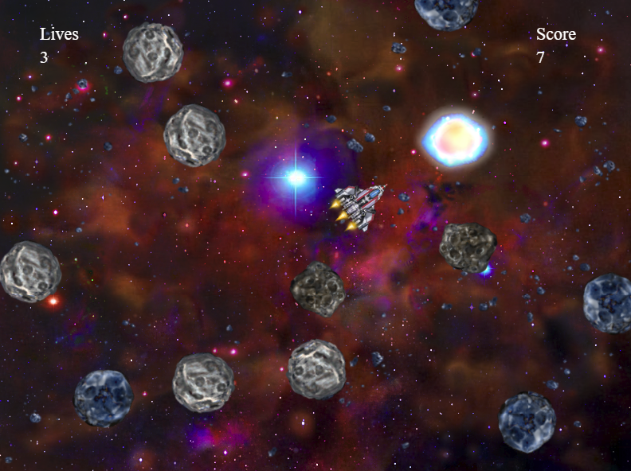

# Space Shooting Game
This game was made using object oriented Python and it was a final project from Rice University online course.

## How to play
Use arrow left and right keys to rotate the ship and up key to start engines. Ship is using friction for braking. Use space to shoot!
## Running the game
This game uses codeskulptor interpreter to work (http://www.codeskulptor.org)
Open (codeskulptor.org) and copy and paste `Rice Rocks CV.py` code to interpreter and click run!
## Thank you
Scott Rixner, Joe Warren and Rice University for amazing 9 weeks

## Final version February 2014.
